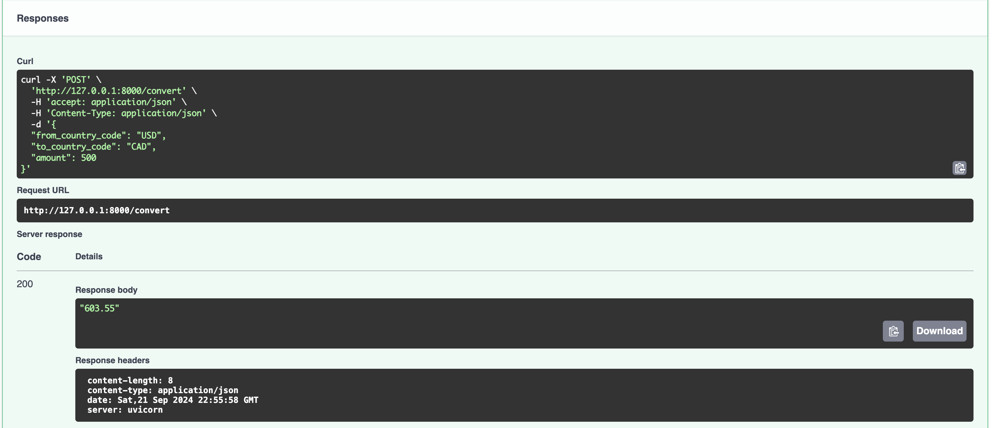
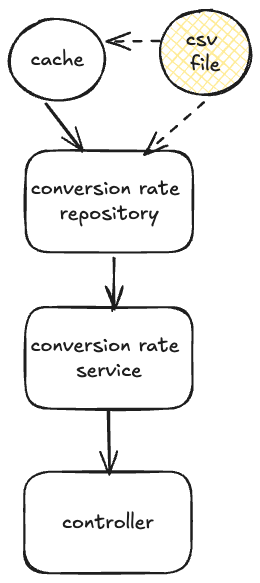
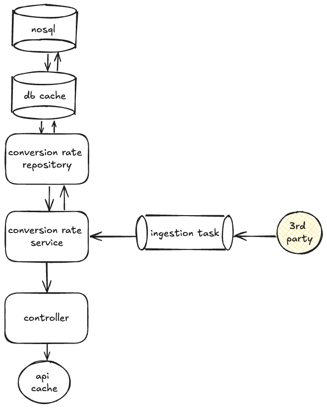

# Currency Converter
This repository features a simple python web controller written in Python using [FastAPI](https://fastapi.tiangolo.com/).  The API exposes three endpoints centered around currency conversion utilities:
- Get all supported conversion rates
- Get conversion rate by country code (if supported)
- Convert amount from one currency to another

# How to run
1. Install Docker desktop
2. Run `docker-compose build --up`
3. Open a browser to http://0.0.0.0:8000/docs
4. Use swagger to interact with the API

# Design

## Repository
The repository encapsulates all logic required to access the database.  In the case of this proof-of-concept, no database is used, but rather the repository caches conversion rates from a CSV file.  
## Service Class
The service class contains any business logic relating to conversion rates or performing currency conversions.
## Controller
The controller endpoints are lean and call into service classes.

# Future Design

## Repository
In the future, we introduce a database and a database cache to optimize fetching frequent or expensive queries.  A normalized database is not highly demanded by this data as we only have one domain model that is not relational to any other entities.  In fact, a key-value NoSQL store like Redis could be suitable.
## Task queue
A task queue or cron job can be used to ingest third party data on a regular cadence.
## Service Class
The service class (or another dedicated ingestion service) will periodically fetch up-to-date conversion rates from a third party service and transform the data if necessary.  This class is then responsible for updating the data store(s).
## API Cache
In the future, we introduce an API cache for improved client performance.
